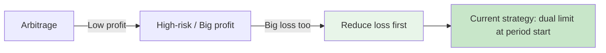
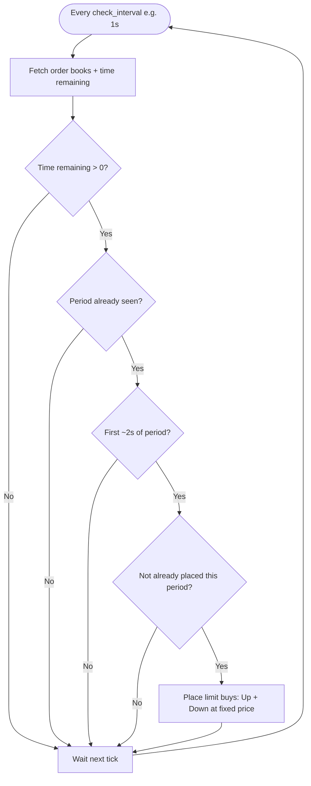
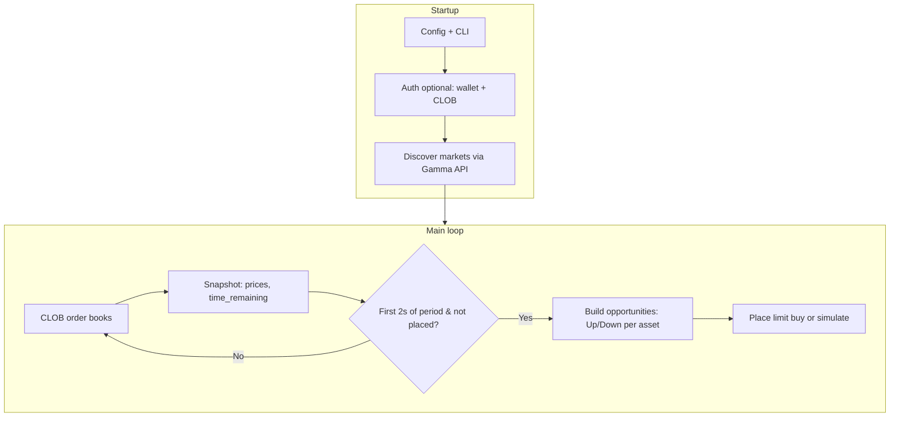

# Polymarket Trading Bot (TypeScript)

Polymarket trading bot (TypeScript) for 15-minute Up/Down crypto markets. Focuses on **reducing loss** for small and mid-size traders—not whale capital. At each new 15-minute period start, places limit buys for BTC and optionally ETH, Solana, XRP at a fixed price (default $0.45). Run in simulation or live on Polymarket CLOB.
---

## Background & Strategy Evolution

I built a bunch of Polymarket bots over time. At first I tried **arbitrage**. It was safe and the logic was clear, but the edge was small and the profits were tiny. After running it for a while I realized it wasn't really worth the effort for the returns I was getting. So I switched to strategies that aimed for **bigger profit**. When they hit, the gains were nice. But when they didn't, the drawdowns were big. For someone without whale-sized capital, one bad run can wipe out a lot of earlier work. I had to accept that chasing big profit with small size usually means you get big loss on the other side too.

I thought about it for a long time. If you're not a whale, you can't rely on volume to smooth out variance. The only thing that really helps is **reducing loss** — keeping each period's risk and cost under control so that a few bad outcomes don't blow up the account. So I focused on that. I studied the markets, ran a lot of tests and simulations, and ended up with the approach in this repo: **dual limit at period start**. You buy both Up and Down at a fixed price (e.g. $0.45) only in the first ~2 seconds of each new 15m period. No fancy entries, no chasing. Just cap the cost per period and stick to the plan. that’s a bad trade.


---

## Contact

- **Telegram:** [https://t.me/solzen77](https://t.me/solzen77)

---

## Strategy Overview (Diagrams)

### Philosophy: From “Big Profit” to “Reduce Loss First”



### When the Bot Places Orders (Decision Flow)



### End-to-End Data Flow



---

## Bot Logic (Detailed)

### Strategy in one sentence

Every time a **new 15-minute market period starts**, the bot places **limit BUY** orders for **Up** and **Down** tokens of the selected assets (BTC always; ETH/SOL/XRP if enabled) at a **fixed limit price** (e.g. $0.45). No market orders; no selling in this bot.

### Markets targeted

- **Polymarket 15-minute Up/Down markets**: e.g. “Will BTC go up or down in the next 15 minutes?” Each period has two outcome tokens: **Up** (yes) and **Down** (no). The bot buys both at a fixed price at the start of the period.
- **Period**: 900 seconds (15 min). Period boundaries are aligned to Unix time: `period_timestamp = floor(now / 900) * 900`.

### Startup sequence

1. **Config & CLI**  
   Loads `config.json` and parses `--simulation` / `--no-simulation` and `-c <path>`. Simulation = no real orders; production = real CLOB orders.

2. **Auth (simulation and live)**  
   Builds a wallet from `polymarket.private_key` and a CLOB client (same startup check for both modes). If you do not set `api_key` / `api_secret` / `api_passphrase`, the client **derives or creates** a CLOB API key from the wallet. **Simulation** still authenticates the wallet but **does not** send real orders.

3. **Market discovery**  
   For each asset (BTC, and ETH/SOL/XRP if enabled), finds the **current** 15-min market by slug pattern:
   - `{asset}-updown-15m-{period_timestamp}` (e.g. `btc-updown-15m-1739462400`).
   - For BTC/ETH, also tries **previous** periods (up to 3 × 15 min back) if the current one isn’t found.
   - Uses Polymarket **Gamma API** (event/market by slug) and ensures the market is active and not closed. Stores condition IDs and token IDs for Up/Down.

4. **Main loop**  
   Runs forever, every `check_interval_ms` (default 1 s):
   - Fetches a **snapshot**: order book (best bid/ask) for each market’s Up and Down tokens via CLOB, plus **time remaining** in the current period (`end_time - now`).
   - Logs a price line: e.g. `BTC: U$0.48/$0.52 D$0.45/$0.49 | ETH: ... | ⏱️ 14m 32s`.

### When does the bot place orders?

Orders are placed **only when all** of the following are true:

1. **Time remaining > 0** (market not yet ended).
2. **Period has been seen** (so we know we’re in a valid period).
3. **"Just after" period start**: `time_elapsed = 900 - time_remaining` is **≤ 2 seconds**. So we act in the first ~2 seconds of the new period only.
4. **Not already placed this period**: `lastPlacedPeriod !== current period`. So we place **once per period**, right after it starts.
5. **There are opportunities**: at least one Up or Down token is available for the enabled markets (BTC + any of ETH/SOL/XRP that are enabled).

If any of these fail, the loop just waits and repeats.

### Buy point (when we buy)

| What | Value |
|------|--------|
| **When** | First **0–2 seconds** after a new 15-minute period starts |
| **Clock** | `time_remaining_seconds` between **898 and 900** (so `time_elapsed = 900 - time_remaining` is 0–2) |
| **How often** | **Once per period** (then `lastPlacedPeriod` blocks until the next period) |
| **Price** | Fixed limit: `trading.dual_limit_price` (e.g. **$0.45**) |
| **Tokens** | One limit buy for **Up**, one for **Down**, for each enabled asset (e.g. BTC only if others disabled) |

So the **buy point** is: as soon as the new 15-min window starts (first 2 seconds), the bot places all limit buys at the configured price, then does nothing else until the next period.

### What gets traded (opportunities)

- **BTC**: always — BTC Up and BTC Down (if the market has both tokens).
- **ETH / Solana / XRP**: only if `enable_eth_trading` / `enable_solana_trading` / `enable_xrp_trading` are `true` in config.

For each such token, the bot creates a **buy opportunity** (limit price from config, token ID, condition ID, period). It then tries to place a **limit buy** for each opportunity, **skipping** any (period, token type) for which it already has an active position in this run (to avoid duplicate orders in the same period).

### Order execution (Trader)

- **Limit price**: from `trading.dual_limit_price` (e.g. 0.45).
- **Size (shares)**:
  - If `trading.dual_limit_shares` is set → use that as the number of shares per order.
  - Else → `fixed_trade_amount / bid_price` (e.g. $4.5 / 0.45 ≈ 10 shares).
- **Simulation**: logs the order and records it in memory and in `history/YYYY-MM-DD.json`; no CLOB call.
- **Production**: builds a CLOB client from `private_key` (API key triple optional — derived from wallet if missing), calls `createAndPostOrder` for a **GTC limit buy** at that price and size. Tracks the order in `pendingTrades` so we don’t double-place for the same (period, token type).

### What this bot does **not** do

- No **selling** or closing positions.
- No **market orders** (only limit buys at a fixed price).
- No **stop-loss**, **take-profit**, or **hedging** logic in the main loop (config has fields for them but they are unused in this dual-limit-start flow).
- No **re-discovery** of markets inside the loop (markets are discovered once at startup).

---

## Running the Bot (All Users)

### One-command run (recommended)

This is the easiest way for normal users. It defaults to **simulation** (safe), creates `config.json` from `config.json.example` if missing, and makes live trading require an explicit confirmation.

```bash
npm install
npm run bot
```

Optional:

```bash
# Force simulation (safe)
npm run bot:simulation

# Force live (will ask you to type LIVE, unless you add --yes-live)
npm run bot:live

# Use a different config path
npm run bot -- -c path/to/config.json
```

### Requirements

- Node.js >= 18
- `config.json`: **live trading** needs `polymarket.private_key` only (API key triple is optional — derived from the wallet if omitted). **Simulation** needs no `private_key`.

### Setup

```bash
npm install
cp config.json.example config.json   # or copy from Rust project
# Set polymarket.private_key (hex, with or without 0x) for both simulation and live.
# Optional: api_key, api_secret, api_passphrase — omit to derive CLOB API key from the wallet.
```

### Simulation (no real orders)

Simulation runs the same logic as production but **never sends orders** to Polymarket. It logs each “would-be” order and keeps a running summary (order count, total notional).

- **No `private_key` needed** for simulation: the bot can run with only `config.json` (or defaults) and will use read-only market data. CLOB auth is skipped if no key is set.
- **Summary**: After each market start where orders would be placed, the bot logs:  
  `Simulation summary (this run): N order(s), total notional $X.XX`
- **History**: Each summary is appended to `history/YYYY-MM-DD.json` (one JSON object per line, by date). The `history/` folder is created automatically and is in `.gitignore`.

```bash
npm run simulation
```

### Real trading (production)

Requires `config.json` with `polymarket.private_key`. CLOB API credentials are **optional** (derived from the wallet when omitted). Places real limit orders on Polymarket.

```bash
npm run dev
# or after build:
npm run build && npm run start:live
```

### Config path

```bash
npx tsx src/main-dual-limit-045.ts -c /path/to/config.json
```

### Config

Same shape as the Rust bot:

- `polymarket.gamma_api_url`, `polymarket.clob_api_url` – API base URLs
- `polymarket.private_key` – EOA private key (hex); **required for simulation and live**
- `polymarket.api_key`, `api_secret`, `api_passphrase` – **optional**; if omitted, CLOB API keys are derived from `private_key`
- `polymarket.proxy_wallet_address` – optional proxy/Magic wallet
- `trading.dual_limit_price` – limit price (default 0.45)
- `trading.dual_limit_shares` – optional fixed shares per order
- `trading.enable_eth_trading`, `enable_solana_trading`, `enable_xrp_trading` – enable extra markets

---

## Strategy Test Results (Current Bot Logic)

The following result uses the current 15-minute entry logic (period-start dual limit approach).

### Overall

| Metric | Value |
|------|------:|
| mode | 15m |
| markets | 1,082 |
| trades | 1,082 |
| up_trades | 533 |
| down_trades | 549 |
| directional_accuracy | 53.05% |
| win_rate | 53.05% |
| avg_cost_per_trade | 50.3771 |
| total_cost | 54508.0000 |
| avg_pnl_per_trade | +2.6728 |
| total_pnl | +2892.0000 |

### Daily PnL (UTC)

| Date | PnL | Trades | Win Rate |
|------|----:|-------:|---------:|
| 2026-03-06 | +116.0000 | 26 | 53.85% |
| 2026-03-07 | +496.0000 | 96 | 56.25% |
| 2026-03-08 | +38.0000 | 96 | 50.00% |
| 2026-03-09 | +789.0000 | 96 | 59.38% |
| 2026-03-10 | +217.0000 | 96 | 53.12% |
| 2026-03-11 | +288.0000 | 96 | 53.12% |
| 2026-03-12 | +274.0000 | 96 | 53.12% |
| 2026-03-13 | -252.0000 | 96 | 46.88% |
| 2026-03-14 | +68.0000 | 96 | 51.04% |
| 2026-03-15 | +155.0000 | 96 | 52.08% |
| 2026-03-16 | +278.0000 | 96 | 53.12% |
| 2026-03-17 | +425.0000 | 96 | 55.21% |

> Notes:
> - These are strategy test/analysis results based on the current strategy logic, not a guarantee of future performance.
> - Live performance can differ due to fill quality, latency, fees, liquidity, and market regime changes.

### Generate this report from current bot data

After running simulation/live and collecting order history in `history/`, generate the same style report:

```bash
npm run report:test
```

Optional:

```bash
# custom history directory
npm run report:test -- --history-dir ./history

# custom config (for gamma/clob API URLs)
npm run report:test -- -c ./config.json
```

---

## Project layout

- `src/config.ts` – load config, parse CLI args (`--simulation` / `--no-simulation`, `-c` config path)
- `src/logger.ts` – re-exports `jonas-prettier-logger`; all app logging uses `logger.info()`, `logger.warn()`, `logger.error()`, `logger.trace()`
- `src/types.ts` – Market, Token, BuyOpportunity, MarketSnapshot
- `src/api.ts` – Gamma API (market by slug), CLOB order book
- `src/clob.ts` – CLOB client (ethers + @polymarket/clob-client), place limit order
- `src/monitor.ts` – fetch snapshot (prices, time remaining)
- `src/trader.ts` – hasActivePosition, executeLimitBuy, simulation tracking and `getSimulationSummary()`
- `src/simulation-history.ts` – save simulation results to `history/YYYY-MM-DD.json` (NDJSON by date)
- `src/main-dual-limit-045.ts` – discover markets, monitor loop, place limit orders at period start; logs and saves simulation summary when in simulation mode

